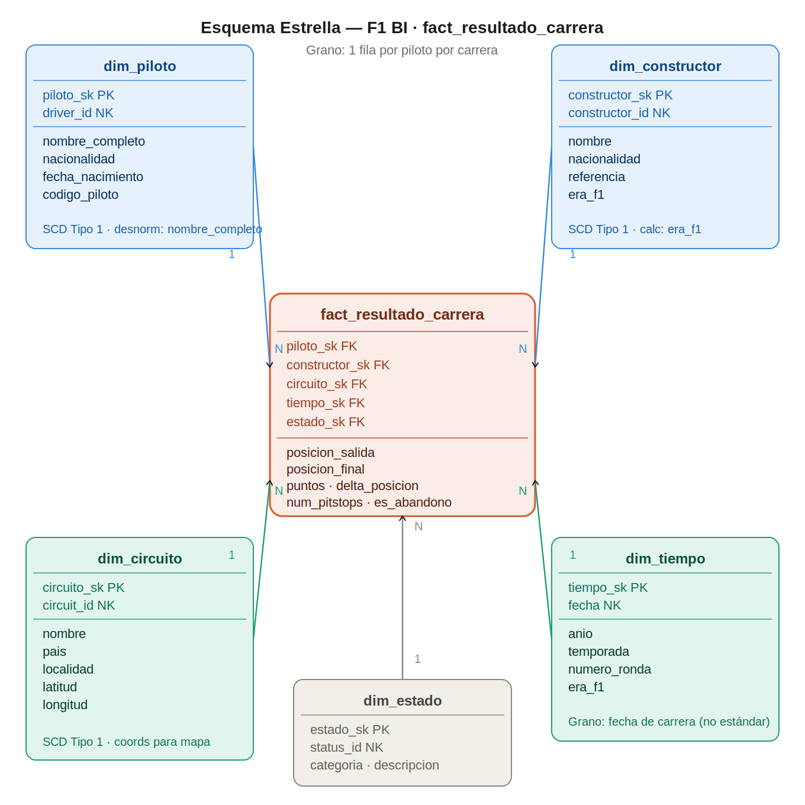

# 🏎️ Proyecto Final — Módulo 4: Inteligencia de Negocios y SQL Avanzado

## Rendimiento de Pilotos y Estrategias de Carrera en Fórmula 1 (1950–2024)

**Repositorio:** [PercastreMarco/Analisis-Formula-1-World-Championship-1950---2024-](https://github.com/PercastreMarco/Analisis-Formula-1-World-Championship-1950---2024-)

---

## 📌 Pregunta Analítica de Negocio

> **¿Qué factores — posición de salida, número y momento de pit stops, equipo y tipo de circuito — tienen mayor impacto estadístico en el resultado final de carrera, y cómo ha evolucionado la dominancia de constructores y pilotos a lo largo de las eras de la Fórmula 1 (1950–2024)?**

### ¿Por qué es accionable?

| Perspectiva | Valor |
|---|---|
| **Para equipos** | Optimizar la estrategia de pit stops y selección de circuitos según el perfil del piloto |
| **Para analistas** | Cuantificar el peso real de la posición de salida vs. la estrategia en el resultado final |
| **Para contexto histórico** | Identificar qué eras fueron dominadas por el constructor vs. por el talento del piloto |

---

## 📂 Estructura del Repositorio

```
proyecto-final/
├── README.md                        ← problema, modelo, cómo ejecutar, hallazgos
├── datasets/
│   └── F1_data.py                   ← descarga automática desde Kaggle con kagglehub
├── scripts/
│   ├── 00_eda.ipynb                 ← análisis exploratorio de datos (EDA)
│   ├── 01_schema_ddl.sql            ← creación del modelo dimensional en Aurora
│   ├── 02_sql_avanzado.sql          ← 5 técnicas de SQL avanzado (DBeaver)
│   ├── 02_sql_avanzado.ipynb        ← mismas queries ejecutables en Colab
│   ├── etl_pipeline.ipynb           ← pipeline ETL completo (Colab)
│   └── etl_pipeline.py              ← mismo pipeline como script Python
├── dashboard/
│   ├── Dashboard.py                 ← app Streamlit con 8 visualizaciones
│   └── 03_dashboard.ipynb           ← launcher del dashboard en Colab + ngrok
└── docs/
    └── diagrama_modelo.png          ← diagrama del esquema estrella
```

---

## 📊 Dataset — Ergast F1 Database (1950–2024)

**Fuente:** [Kaggle — Formula 1 World Championship (1950–2024)](https://www.kaggle.com/datasets/rohanrao/formula-1-world-championship-1950-2020) · Dominio público

**Descarga automática desde Colab:**
```python
import kagglehub
DATA_PATH = kagglehub.dataset_download("rohanrao/formula-1-world-championship-1950-2020")
```

| Atributo | Detalle |
|---|---|
| **Archivos** | 14 archivos CSV interconectados con claves relacionales |
| **Volumen total** | ~590,000+ filas |
| **Cobertura** | 74 temporadas · ~1,100 GPs · 857 pilotos · 77 circuitos |
| **Actualización** | Temporada 2024 |

### Tablas principales

| Archivo | Filas aprox. | Descripción |
|---|---|---|
| `results.csv` | ~26,000 | Posición de salida, posición final, puntos, vueltas y status |
| `races.csv` | ~1,100 | Fecha, circuito, temporada y nombre del Gran Premio |
| `pit_stops.csv` | ~10,000+ | Duración, vuelta y posición en cada parada (desde 1994) |
| `lap_times.csv` | ~540,000 | Tiempo de vuelta por piloto (desde 1996) |
| `drivers.csv` | 857 | Nombre, nacionalidad, fecha de nacimiento |
| `constructors.csv` | 211 | Nombre y nacionalidad del constructor |
| `circuits.csv` | 77 | Nombre, país y coordenadas geográficas |
| `qualifying.csv` | ~10,000 | Tiempos Q1/Q2/Q3 y posición de clasificación |

> **Nota EDA:** `pit_stops.csv` solo tiene cobertura desde 1994. Los registros anteriores tienen `num_pitstops = 0` por ausencia de datos, no porque no pararan. Ver `00_eda.ipynb` para el análisis completo de cobertura y decisiones de limpieza.

---

## 🗂️ Modelo Dimensional

### Esquema estrella



### Grano declarado

> **Un registro por piloto por carrera.**

Cada fila en `fact_resultado_carrera` representa el resultado de un piloto en una carrera específica. Permite análisis individuales y agregaciones por equipo, circuito y temporada sin pérdida de granularidad.

### Tabla de hechos — `fact_resultado_carrera`

| Columna | Tipo | Descripción |
|---|---|---|
| `piloto_sk` | INT FK | Surrogate key → dim_piloto |
| `constructor_sk` | INT FK | Surrogate key → dim_constructor |
| `circuito_sk` | INT FK | Surrogate key → dim_circuito |
| `tiempo_sk` | INT FK | Surrogate key → dim_tiempo |
| `estado_sk` | INT FK | Surrogate key → dim_estado |
| `posicion_salida` | INT | Grid position (NULL = pit lane start) |
| `posicion_final` | INT | Posición oficial (NULL si abandono) |
| `puntos` | NUMERIC | Puntos según el sistema de la era |
| `vueltas_completadas` | INT | Vueltas completadas en carrera |
| `num_pitstops` | INT | Conteo de paradas calculado en ETL (0 antes de 1994 = sin datos) |
| `tiempo_total_ms` | BIGINT | Tiempo total en ms (NULL si abandono) |
| `delta_posicion` | INT | `posicion_salida − posicion_final` (+ = ganó posiciones) |
| `es_abandono` | BOOLEAN | Flag derivado del `status_id` |

**Clave primaria:** `(piloto_sk, tiempo_sk)` — unicidad al nivel del grano.

### Dimensiones

| Dimensión | Filas | SCD | Atributos clave |
|---|---|---|---|
| `dim_piloto` | 861 | Tipo 1 | nombre_completo, nacionalidad, fecha_nacimiento, codigo_piloto |
| `dim_constructor` | 212 | Tipo 1 | nombre, nacionalidad, constructor_ref, era_f1 |
| `dim_circuito` | 77 | Tipo 1 | nombre, pais, localidad, latitud, longitud |
| `dim_tiempo` | 1,125 | Tipo 1 | fecha, anio, temporada, numero_ronda, era_f1 |
| `dim_estado` | 139 | Tipo 1 | descripcion, categoria |

### Decisiones de diseño

**`dim_piloto`** — `forename + surname` desnormalizados en `nombre_completo` para simplificar GROUP BY. `fecha_nacimiento` incluida para análisis age-performance.

**`dim_constructor`** — Atributo calculado `era_f1` (ej. "Era turbo 1977–88", "Era híbrida 2014+") para análisis de dominancia histórica sin CTEs repetitivos en cada consulta.

**`dim_circuito`** — Colapsa `circuits.csv` + metadata de `races.csv`. Coordenadas geográficas (`latitud`, `longitud`) para mapas en el dashboard.

**`dim_tiempo`** — Grano de fecha de carrera (no calendario diario), porque F1 tiene calendario irregular. `numero_ronda` para análisis de momentum dentro de temporada; `era_f1` para filtros históricos sin CTEs repetitivos.

**`dim_estado`** — 140+ códigos de status mapeados a 5 categorías: `Finalizado`, `Abandono mecanico`, `Accidente`, `Descalificado`, `Otro`. Evita CASE WHEN complejos en cada consulta analítica.

**Surrogate keys** — Generadas con `index + 1` en el ETL. Natural keys (`_id`) conservadas para auditoría y joins con fuentes externas.

---

## ☁️ Infraestructura AWS — Aurora PostgreSQL

| Parámetro | Valor |
|---|---|
| **Motor** | Aurora PostgreSQL 15.x |
| **Tipo de instancia** | `db.t3.medium` |
| **Región** | `us-east-1` |
| **Puerto** | `5432` |
| **Base de datos** | `postgres` |
| **Schema DW** | `f1_dw` (separado del esquema `public`) |

### Secrets de Google Colab requeridos

| Secret | Descripción |
|---|---|
| `F1_HOST` | Endpoint del cluster Aurora (ej. `xxx.cluster.rds.amazonaws.com`) |
| `F1_data` | Password del usuario de Aurora |
| `AURORA_USER` | Usuario de la base de datos (ej. `postgres`) |
| `NGROK_TOKEN` | Token para el túnel del dashboard ([ngrok.com](https://dashboard.ngrok.com)) |

> El schema `f1_dw` mantiene el DW aislado del esquema `public`. Las credenciales se gestionan como Secrets de Colab — nunca se hardcodean en el código ni en el repositorio.

### Buenas prácticas aplicadas

- Schema `f1_dw` separado del esquema `public` (OLTP)
- Naming consistente: prefijos `dim_`/`fact_`, sufijos `_sk` (surrogate key), `_id` (natural key)
- `COMMENT ON TABLE/COLUMN` en cada objeto del DDL para documentación interna
- 7 índices optimizados para los patrones de consulta del dashboard
- Índice parcial `WHERE es_abandono = TRUE` para filtros de abandono frecuentes
- Credenciales en Secrets de Colab, nunca en el código

---

## 🔬 EDA — Análisis Exploratorio (`00_eda.ipynb`)

El EDA se ejecuta **antes del ETL** para justificar cada decisión de limpieza con evidencia real del dataset. Sin EDA, el ETL limpia a ciegas.

| Sección | Hallazgo principal |
|---|---|
| Cobertura | `pit_stops.csv` solo desde 1994; `lap_times.csv` desde 1996 |
| Nulos críticos | `grid = 0` significa pit lane start, no posición real de salida |
| Outliers | Tiempos de vuelta extremos por safety car — filtrar p1–p99 en análisis de ritmo |
| Consistencia | 0 IDs huérfanos entre tablas — integridad referencial perfecta en el dataset |
| Distribuciones | La pole position gana ~40% de las carreras históricamente |
| Sistema de puntos | 5 sistemas distintos entre 1950 y 2024 — guardar puntos reales, normalizar en SQL |

### Decisiones de limpieza implementadas en el ETL

| Problema | Causa | Decisión |
|---|---|---|
| `grid = 0` | Pit lane start | Convertir a `NULL` en `posicion_salida` |
| `milliseconds` nulo | Abandono / sin datos | Mantener `NULL` — no imputar |
| `pit_stops < 1994` | Sin cobertura histórica | `num_pitstops = 0` significa sin datos, no 0 paradas |
| `lap_times` extremos | Safety car / vuelta lenta | Filtrar p1–p99 en análisis de ritmo, no en la fact table |
| Puntos multisistema | 5 sistemas históricos | Guardar puntos reales; normalizar por era en SQL |
| 91 duplicados en `results.csv` | Datos duplicados Ergast | `drop_duplicates(subset=['piloto_sk','tiempo_sk'])` en ETL |

---

## ⚙️ Pipeline ETL (`etl_pipeline.ipynb` / `etl_pipeline.py`)

### Arquitectura del pipeline

```
Extract            Transform                  Load                 Validate
───────────        ─────────────────────      ─────────────────    ────────────────
14 CSVs       →   dim_piloto            →    TRUNCATE         →   Conteo BD vs CSV
Ergast            dim_constructor            + to_sql()            FKs huérfanas
kagglehub         dim_circuito               method='multi'        Nulos críticos
                  dim_tiempo                 chunksize=500
                  dim_estado
                  fact_resultado_carrera
                  (drop_duplicates PK)
```

### Características del pipeline

- **Modular:** funciones separadas `extract()`, `transform_dim_*()`, `transform_fact()`, `load_table()`, `load_fact()`, `validate()`
- **Idempotente:** `TRUNCATE + to_sql()` en todas las tablas — re-ejecutable sin duplicados
- **Logging:** timestamps y niveles (`INFO`, `WARNING`, `ERROR`) en cada paso
- **Manejo de errores:** `try/catch` en `main()`, warnings en archivos faltantes y nulos
- **Validaciones post-carga:** conteo BD vs CSV, FKs huérfanas, nulos en columnas críticas
- **Compatible con SQLAlchemy 2.x:** usa `bindparams()` y `to_sql(method='multi')`

### Resultados de carga verificados

| Tabla | Filas cargadas | PKs duplicadas | FKs huérfanas |
|---|---|---|---|
| `dim_piloto` | 861 | — | — |
| `dim_constructor` | 212 | — | — |
| `dim_circuito` | 77 | — | — |
| `dim_tiempo` | 1,125 | — | — |
| `dim_estado` | 139 | — | — |
| `fact_resultado_carrera` | 26,668 | ✅ 0 | ✅ 0 |

---

## 🧠 SQL Avanzado (`02_sql_avanzado.sql` / `02_sql_avanzado.ipynb`)

Cinco técnicas aplicadas a preguntas reales del problema — no ejercicios sintéticos.

| # | Técnica | Funciones | Pregunta que responde |
|---|---|---|---|
| 1 | **Window Functions** | `SUM() OVER`, `LAG()`, `RANK()` | ¿Quién lidera el campeonato en cada ronda? |
| 2 | **CTEs anidados** — 3 niveles | `WITH base → metricas → ranking` | ¿Qué constructores son más eficientes por era? |
| 3 | **`PERCENTILE_CONT`** | `WITHIN GROUP (ORDER BY)` | ¿Desde qué grid mediano se gana en cada circuito? |
| 4 | **Funciones de fecha** | `DATE_PART()`, `AGE()`, `LAG()` | ¿Cómo evoluciona la edad promedio de ganadores? |
| 5 | **Stored Procedure** | `CREATE PROCEDURE`, `plpgsql` | Resumen de dominancia por constructor para cualquier temporada |

**Uso del Stored Procedure:**
```sql
-- En DBeaver (conectado a postgres, SET search_path TO f1_dw)
CALL f1_dw.resumen_temporada(2023);
SELECT * FROM tmp_resumen ORDER BY puntos_totales DESC;
```

**Correcciones técnicas aplicadas:**
- `RANK()` separado en CTE propio para evitar anidamiento de window functions (error `42P20`)
- `NULLIF(COUNT(*), 0)` en todos los porcentajes para evitar división por cero
- `LAG()` sobre columna materializada en CTE previo (no sobre `AVG()` directo)
- `RANK() OVER` fuera del `CREATE TABLE AS` en el stored procedure

---

## 📊 Dashboard — Streamlit (`Dashboard.py`)

**Lanzar desde Google Colab:** abrir `dashboard/03_dashboard.ipynb` y ejecutar celda por celda.

### Visualizaciones — cobertura completa de la pregunta analítica

| # | Sección | Técnica SQL | Factor de la pregunta analítica |
|---|---|---|---|
| 01 | Campeonato — evolución de puntos por ronda | Window Functions | Dominancia de pilotos por era |
| 02 | Pit stops — delta posición por N° de paradas | Agregaciones | Número de pit stops |
| 03 | Grid — % victorias por posición de salida | Agregaciones | Posición de salida |
| 04 | Estrategia por era — 1, 2 o 3 paradas | Agregaciones + CTEs | Momento y número de pit stops |
| 05 | Dominancia — eficiencia de constructores | CTEs anidados | Equipo / constructor |
| 06 | Circuitos — posición mediana de ganadores | PERCENTILE_CONT | Tipo de circuito |
| 07 | Edad — evolución de ganadores 1950–2024 | DATE_PART + LAG | Evolución histórica |
| 08 | Resumen de temporada por constructor | Stored Procedure | Dominancia de constructores |

### Filtros interactivos (sidebar)

- **Temporada** (1950–2023) — afecta VIZ 01 y VIZ 08
- **Top N pilotos** (3–10) — afecta VIZ 01
- **Eras históricas** (multiselect) — afecta VIZ 02, 04, 05 y 07
- **Top N circuitos + radio button** — afecta VIZ 06

---

## 🚀 Cómo Ejecutar el Proyecto

### Pre-requisitos

```bash
pip install kagglehub pandas sqlalchemy psycopg2-binary streamlit plotly pyngrok
```

### Paso 1 — Configurar Secrets en Google Colab

En el panel izquierdo de Colab (ícono 🔑 → Secrets), agregar:

| Nombre | Valor |
|---|---|
| `F1_HOST` | Endpoint Aurora (ej. `xxx.cluster.rds.amazonaws.com`) |
| `F1_data` | Password de Aurora |
| `AURORA_USER` | Usuario (ej. `postgres`) |
| `NGROK_TOKEN` | Token de [ngrok.com](https://dashboard.ngrok.com) |

### Paso 2 — Crear el schema en Aurora (DBeaver)

```sql
-- 1. Verificar que estás conectado a la base correcta
SELECT current_database();  -- Debe devolver: postgres

-- 2. Ejecutar el DDL completo con Alt+X
-- Archivo: scripts/01_schema_ddl.sql

-- 3. Verificar las 6 tablas creadas
SELECT table_name FROM information_schema.tables
WHERE table_schema = 'f1_dw' ORDER BY table_name;
```

### Paso 3 — Ejecutar el EDA (recomendado)

```
Colab → abrir scripts/00_eda.ipynb → Run All
```

Tiempo estimado: ~3 minutos. Genera visualizaciones de cobertura, nulos, outliers y consistencia.

### Paso 4 — Ejecutar el ETL

```
Colab → abrir scripts/etl_pipeline.ipynb → Run All
```

Resultado esperado en la celda VALIDATE:
```
✅ dim_piloto              861 filas  |  CSV: 861  ✓
✅ dim_constructor         212 filas  |  CSV: 212  ✓
✅ dim_circuito             77 filas  |  CSV:  77  ✓
✅ dim_tiempo            1,125 filas  |  CSV: 1125 ✓
✅ dim_estado              139 filas  |  CSV: 139  ✓
✅ fact_resultado_carrera 26,668 filas
PKs duplicadas: ✅ 0
FKs huérfanas:  ✅ 0
```

### Paso 5 — Ejecutar el SQL avanzado (opcional)

```
DBeaver → scripts/02_sql_avanzado.sql → ejecutar por sección con Ctrl+Enter
Colab   → scripts/02_sql_avanzado.ipynb → Run All
```

### Paso 6 — Lanzar el dashboard

```
Colab → abrir dashboard/03_dashboard.ipynb → Run All
```

Abre la URL de ngrok en el navegador → clic en **"Visit Site"** → dashboard disponible.

> **Nota:** Si el puerto 8501 queda ocupado entre sesiones, ejecutar:
> ```python
> !pkill -9 -f streamlit; !fuser -k 8501/tcp
> ```

---

## 🔍 Hallazgos Principales

**Factor 1 — Posición de salida**
La pole position gana ~40% de las carreras históricamente. Es el factor individual con mayor impacto, especialmente en circuitos urbanos (Mónaco, Bakú) donde el adelantamiento es técnicamente imposible.

**Factor 2 — Estrategia de pit stops**
En la era híbrida (2014+) las estrategias de 2 paradas generan mayor porcentaje de podios que las de 1 parada. En la era turbo (1977–88) la alta tasa de abandono mecánico (~45%) hace que terminar la carrera sea en sí mismo un resultado estratégico.

**Factor 3 — Tipo de circuito**
Circuitos como Mónaco y Hungaroring tienen mediana de grid del ganador = 1 (la pole casi siempre gana). Circuitos como Spa-Francorchamps y Monza tienen IQR alto, favoreciendo estrategias desde posiciones más atrás.

**Factor 4 — Dominancia de constructores por era**
Ferrari dominó las eras tempranas; Williams y McLaren el período 1984–1993; Ferrari 1999–2004; Red Bull 2010–2013 y 2022+; Mercedes 2014–2021. En la era híbrida, Mercedes acumuló 8 títulos consecutivos de constructores (2014–2021).

**Factor 5 — Evolución histórica**
La edad promedio de los ganadores bajó de ~32 años en los años 50 a ~26–28 años en la era híbrida. Los sistemas KERS/ERS y la mayor exigencia física favorecen a pilotos más jóvenes con mayor capacidad de adaptación.

---

## 🛠️ Stack Tecnológico

| Capa | Tecnología |
|---|---|
| **Dataset** | Ergast F1 Database · Kaggle · `kagglehub` |
| **Almacenamiento** | AWS Aurora PostgreSQL 15.x · Schema `f1_dw` |
| **EDA** | Python · pandas · matplotlib · seaborn |
| **ETL** | Python · pandas · SQLAlchemy 2.x · `to_sql(method='multi')` |
| **SQL avanzado** | Window Functions · CTEs · PERCENTILE_CONT · DATE_PART · Stored Procedure |
| **Dashboard** | Streamlit · Plotly · ngrok |
| **Entorno** | Google Colab · GitHub · DBeaver |

---

## 👤 Autor

**Marco Percastre**
Proyecto Final — Módulo 4: Inteligencia de Negocios y SQL Avanzado

Repositorio: [github.com/PercastreMarco/Analisis-Formula-1-World-Championship-1950---2024-](https://github.com/PercastreMarco/Analisis-Formula-1-World-Championship-1950---2024-)

Docente: 
*Oscar Alvarez C.* [perfil en GitHub](https://github.com/OscarAlvarezC)
